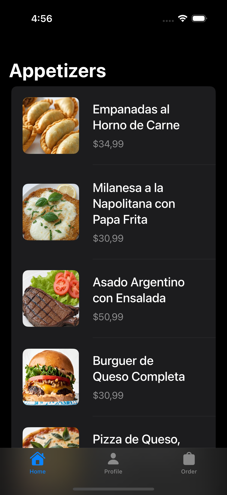
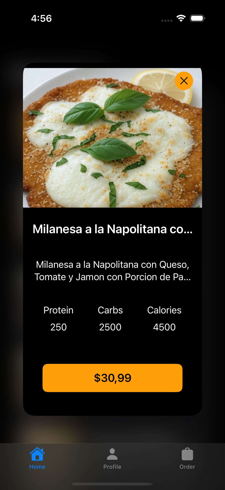
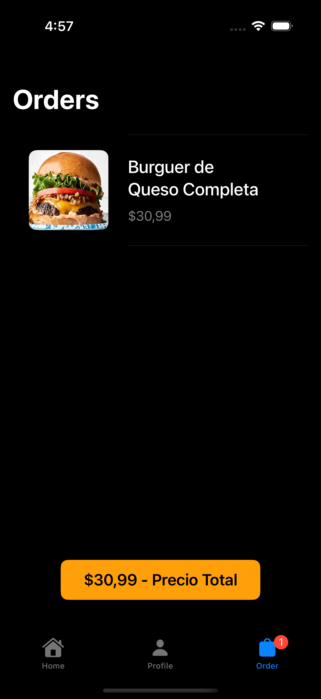
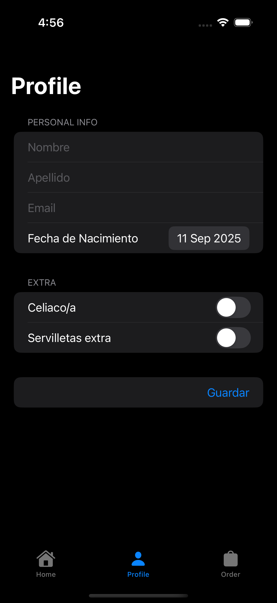

📱 Appetizers – Food App (SwiftUI + Supabase)

Aplicación de comida y aperitivos desarrollada en SwiftUI, con integración de backend en Supabase y manejo seguro de credenciales mediante Secrets.xcconfig.
Este proyecto forma parte de mi portfolio en iOS Development.

✨ Features

🎨 Interfaz moderna con SwiftUI

🔄 Consumo de APIs alojadas en Supabase

🔐 Manejo de seguridad con Secrets.xcconfig para API Keys y credenciales

📦 Arquitectura desacoplada con MVVM

📱 Compatible con iOS 17+

🛠️ Tecnologías usadas

Lenguaje: Swift 6.2

UI: SwiftUI

Backend: Supabase
 (PostgreSQL + Auth + Storage)

Persistencia: @State, @Observable, y manejo de estado reactivo

Seguridad: Secrets.xcconfig
 para ocultar claves sensibles

IDE: Xcode 26

🚀 Instalación y ejecución

Cloná el repositorio:

git clone https://github.com/GermanBonnettini/Food_App_SwiftUI.git
cd Food_App_SwiftUI

Abrí el proyecto en Xcode 26.

Configurá tu archivo Secrets.xcconfig con tus claves de Supabase:

SUPABASE_URL = https://<your-project>.supabase.co
SUPABASE_ANON_KEY = <your-anon-key>

Seleccioná un simulador o dispositivo y ejecutá con ⌘R.

🔐 Seguridad

Las claves privadas nunca se suben al repositorio.

Se gestionan mediante Secrets.xcconfig, que está incluido en .gitignore.

De esta forma se mantiene el proyecto seguro y portable.

📸 Screenshots

   

📜 License

Este proyecto está disponible bajo la licencia MIT. Mirá el archivo LICENSE
 para más detalles.

👉 Repo: Food_App_SwiftUI
